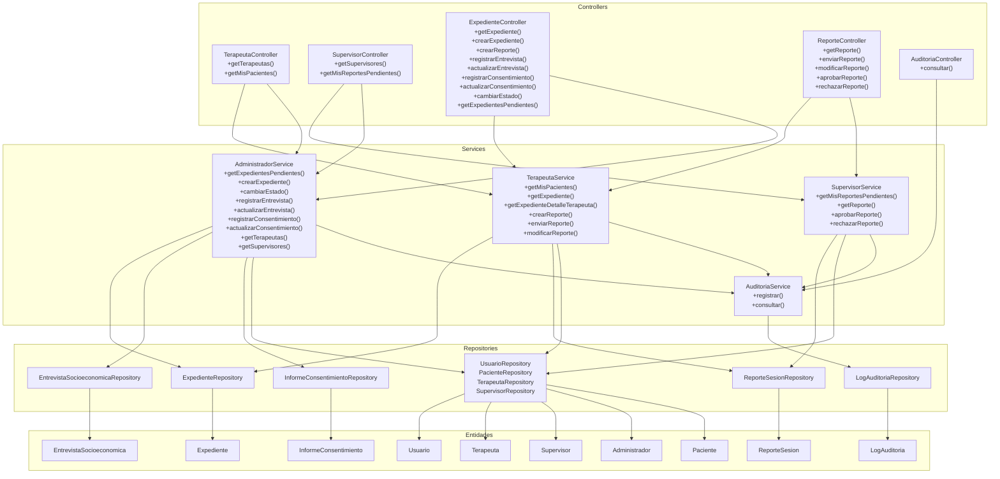
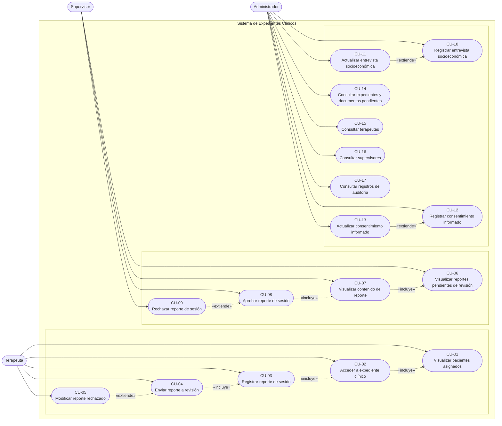
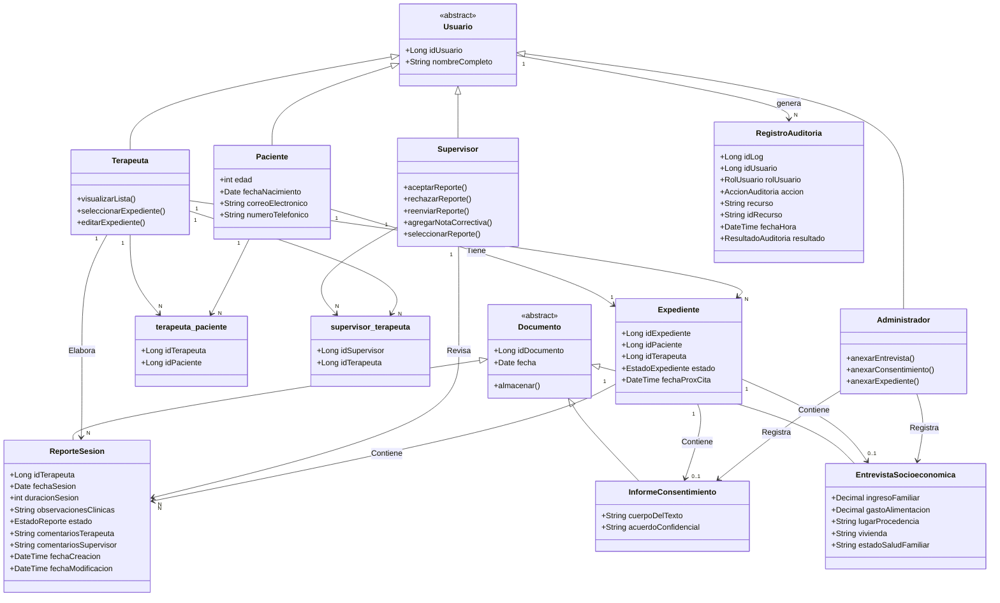

# Diagramas del Sistema de Expedientes Clínicos

---

## Diagrama de Arquitectura

```mermaid
flowchart TB
    subgraph Controllers
        direction LR
        C1["TerapeutaController\n+getTerapeutas()\n+getMisPacientes()"]
        C2["SupervisorController\n+getSupervisores()\n+getMisReportesPendientes()"]
        C3["ExpedienteController\n+getExpediente()\n+crearExpediente()\n+crearReporte()\n+registrarEntrevista()\n+actualizarEntrevista()\n+registrarConsentimiento()\n+actualizarConsentimiento()\n+cambiarEstado()\n+getExpedientesPendientes()"]
        C4["ReporteController\n+getReporte()\n+enviarReporte()\n+modificarReporte()\n+aprobarReporte()\n+rechazarReporte()"]
        C5["AuditoriaController\n+consultar()"]
    end

    subgraph Services
        direction LR
        S1["TerapeutaService\n+getMisPacientes()\n+getExpediente()\n+getExpedienteDetalleTerapeuta()\n+crearReporte()\n+enviarReporte()\n+modificarReporte()"]
        S2["SupervisorService\n+getMisReportesPendientes()\n+getReporte()\n+aprobarReporte()\n+rechazarReporte()"]
        S3["AdministradorService\n+getExpedientesPendientes()\n+crearExpediente()\n+cambiarEstado()\n+registrarEntrevista()\n+actualizarEntrevista()\n+registrarConsentimiento()\n+actualizarConsentimiento()\n+getTerapeutas()\n+getSupervisores()"]
        S4["AuditoriaService\n+registrar()\n+consultar()"]
    end

    subgraph Repositories
        direction LR
        R1["ExpedienteRepository"]
        R2["ReporteSesionRepository"]
        R3["EntrevistaSocioeconomicaRepository"]
        R4["InformeConsentimientoRepository"]
        R5["UsuarioRepository\nPacienteRepository\nTerapeutaRepository\nSupervisorRepository"]
        R6["LogAuditoriaRepository"]
    end

    subgraph Entidades
        direction LR
        E1["Usuario"]
        E2["Terapeuta"]
        E3["Supervisor"]
        E4["Administrador"]
        E5["Paciente"]
        E6["Expediente"]
        E7["ReporteSesion"]
        E8["EntrevistaSocioeconomica"]
        E9["InformeConsentimiento"]
        E10["LogAuditoria"]
    end

    C1 --> S1
    C1 --> S3
    C2 --> S2
    C2 --> S3
    C3 --> S1
    C3 --> S3
    C4 --> S1
    C4 --> S2
    C5 --> S4

    S1 --> R1
    S1 --> R2
    S1 --> R5
    S1 --> S4
    S2 --> R2
    S2 --> R5
    S2 --> S4
    S3 --> R1
    S3 --> R3
    S3 --> R4
    S3 --> R5
    S3 --> S4
    S4 --> R6

    R1 --> E6
    R2 --> E7
    R3 --> E8
    R4 --> E9
    R5 --> E1
    R5 --> E2
    R5 --> E3
    R5 --> E4
    R5 --> E5
    R6 --> E10
```

---

## Diagrama de Casos de Uso

```mermaid
flowchart LR
    T(["Terapeuta"])
    Sup(["Supervisor"])
    Adm(["Administrador"])

    subgraph SYS["Sistema de Expedientes Clínicos"]
        direction TB
        subgraph ST["  "]
            CU01(["CU-01\nVisualizar pacientes asignados"])
            CU02(["CU-02\nAcceder a expediente clínico"])
            CU03(["CU-03\nRegistrar reporte de sesión"])
            CU04(["CU-04\nEnviar reporte a revisión"])
            CU05(["CU-05\nModificar reporte rechazado"])
        end
        subgraph SS["  "]
            CU06(["CU-06\nVisualizar reportes pendientes de revisión"])
            CU07(["CU-07\nVisualizar contenido de reporte"])
            CU08(["CU-08\nAprobar reporte de sesión"])
            CU09(["CU-09\nRechazar reporte de sesión"])
        end
        subgraph SA["  "]
            CU10(["CU-10\nRegistrar entrevista socioeconómica"])
            CU11(["CU-11\nActualizar entrevista socioeconómica"])
            CU12(["CU-12\nRegistrar consentimiento informado"])
            CU13(["CU-13\nActualizar consentimiento informado"])
            CU14(["CU-14\nConsultar expedientes y documentos pendientes"])
            CU15(["CU-15\nConsultar terapeutas"])
            CU16(["CU-16\nConsultar supervisores"])
            CU17(["CU-17\nConsultar registros de auditoría"])
        end
    end

    T --> CU01
    T --> CU02
    T --> CU03
    T --> CU04
    T --> CU05

    CU02 -.->|"«incluye»"| CU01
    CU03 -.->|"«incluye»"| CU02
    CU04 -.->|"«incluye»"| CU03
    CU05 -.->|"«extiende»"| CU04

    Sup --> CU06
    Sup --> CU07
    Sup --> CU08
    Sup --> CU09

    CU07 -.->|"«incluye»"| CU06
    CU08 -.->|"«incluye»"| CU07
    CU09 -.->|"«extiende»"| CU08

    Adm --> CU10
    Adm --> CU11
    Adm --> CU12
    Adm --> CU13
    Adm --> CU14
    Adm --> CU15
    Adm --> CU16
    Adm --> CU17

    CU11 -.->|"«extiende»"| CU10
    CU13 -.->|"«extiende»"| CU12
```

---

## Diagrama de Clases

```mermaid
classDiagram
    class Usuario {
        <<abstract>>
        +Long idUsuario
        +String nombreCompleto
    }

    class Paciente {
        +int edad
        +Date fechaNacimiento
        +String correoElectronico
        +String numeroTelefonico
    }

    class Terapeuta {
        +visualizarLista()
        +seleccionarExpediente()
        +editarExpediente()
    }

    class Supervisor {
        +aceptarReporte()
        +rechazarReporte()
        +reenviarReporte()
        +agregarNotaCorrectiva()
        +seleccionarReporte()
    }

    class Administrador {
        +anexarEntrevista()
        +anexarConsentimiento()
        +anexarExpediente()
    }

    class terapeuta_paciente {
        +Long idTerapeuta
        +Long idPaciente
    }

    class supervisor_terapeuta {
        +Long idSupervisor
        +Long idTerapeuta
    }

    class Documento {
        <<abstract>>
        +Long idDocumento
        +Date fecha
        +almacenar()
    }

    class Expediente {
        +Long idExpediente
        +Long idPaciente
        +Long idTerapeuta
        +EstadoExpediente estado
        +DateTime fechaProxCita
    }

    class ReporteSesion {
        +Long idTerapeuta
        +Date fechaSesion
        +int duracionSesion
        +String observacionesClinicas
        +EstadoReporte estado
        +String comentariosTerapeuta
        +String comentariosSupervisor
        +DateTime fechaCreacion
        +DateTime fechaModificacion
    }

    class InformeConsentimiento {
        +String cuerpoDelTexto
        +String acuerdoConfidencial
    }

    class EntrevistaSocioeconomica {
        +Decimal ingresoFamiliar
        +Decimal gastoAlimentacion
        +String lugarProcedencia
        +String vivienda
        +String estadoSaludFamiliar
    }

    class RegistroAuditoria {
        +Long idLog
        +Long idUsuario
        +RolUsuario rolUsuario
        +AccionAuditoria accion
        +String recurso
        +String idRecurso
        +DateTime fechaHora
        +ResultadoAuditoria resultado
    }

    Usuario <|-- Paciente
    Usuario <|-- Terapeuta
    Usuario <|-- Supervisor
    Usuario <|-- Administrador

    Documento <|-- ReporteSesion
    Documento <|-- InformeConsentimiento
    Documento <|-- EntrevistaSocioeconomica

    Paciente "1" --> "1" Expediente : Tiene
    Terapeuta "1" --> "N" Expediente : Asignado a

    Terapeuta "1" --> "N" terapeuta_paciente
    Paciente "1" --> "N" terapeuta_paciente

    Supervisor "1" --> "N" supervisor_terapeuta
    Terapeuta "1" --> "N" supervisor_terapeuta

    Terapeuta "1" --> "N" ReporteSesion : Elabora
    Supervisor "1" --> "N" ReporteSesion : Revisa

    Expediente "1" --> "N" ReporteSesion : Contiene
    Expediente "1" --> "0..1" InformeConsentimiento : Contiene
    Expediente "1" --> "0..1" EntrevistaSocioeconomica : Contiene

    Administrador --> InformeConsentimiento : Registra
    Administrador --> EntrevistaSocioeconomica : Registra

    Usuario "1" --> "N" RegistroAuditoria : genera
```
